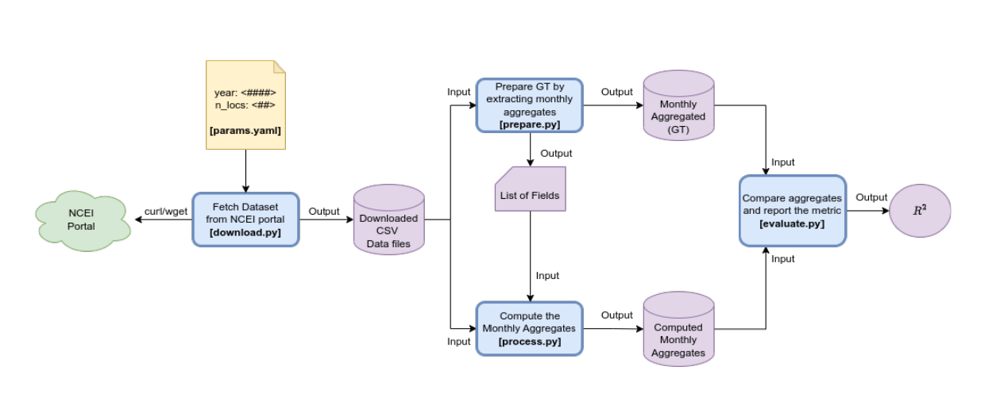

# NOAA Climatological Data Processing Pipeline

We will setup a pipeline to verify a dataset’s consistency. Our proposed pipeline will acquire the public domain climatological data from National Centers for Environmental Information. The archive contains data collected from over 13400 stations from YYYY=1901 to YYYY=2024. Each year in every station the data is collected multiple times a day on the readings of Altimeter, DewPointTemperature, DryBulbTemperature, Precipitation, PresentWeatherType, PressureChange, PressureTendency, RelativeHumidity, SkyConditions, SeaLevelPressure, StationPressure, Visibility, WetBulbTemperature, WindDirection, WindGustSpeed, WindSpeed, Sunrise, Sunset readings.


The data files (CSV formatted location specific files) also contain aggregate entries for monthly averages. We want to setup our pipeline to extract those monthly aggregates to compare them against the computed monthly averages from day wise data points. We shall use all the fields that have the monthly aggregate information. Once the monthly aggregates (ground truth in our experiment) and the estimated monthly aggregates (predicted outcome in our experiment) are ready, we shall compute the R2 score as our measurement of consistency. If the R 2 >= 0.9, we call them as consistent (C).



To accomplish the task outlined, we'll follow the steps provided while setting up the pipeline using Git and DVC. Here's a step-by-step guide:

### 1. Install Git and DVC
Install Git and DVC on your system if you haven't already. You can follow the instructions provided by the respective tools for your operating system.

### 2. Create a Blank Project in GitHub
Create a new repository on GitHub to host your project.

### 3. Initialize Git Repository Locally
```
mkdir climatology-consistency-pipeline
cd climatology-consistency-pipeline
git init
```

### 4. Link Local Repository with GitHub Repository
```
git remote add origin <repository_URL>
```

### 5. Initialize DVC
```
dvc init
```

### 6. Add Stages to the Pipeline
We'll add stages to the pipeline to perform the required tasks. Here's the pipeline structure:

- **Stage 1: Data Acquisition**
  - Script: `download.py`
  - Output: CSV data files from National Centers for Environmental Information (NCEI)

- **Stage 2: Data Preparation**
  - Script: `prepare.py`
  - Dependencies: CSV data files
  - Output: Extracted monthly aggregates of relevant fields and list of fields

  - Script: `process.py`
  - Dependencies: CSV data files and list of fields
  - Output: Computed monthly aggregates of relevant fields

- **Stage 3: Calculate R2 Score**
  - Script: `evaluate.py`
  - Dependencies: Extracted and computed monthly aggregates
  - Output: R2 score

Add these stages using the `dvc stage add` command with appropriate flags for versioning, visualization, etc.

### 7. Visualize the DAG
```
dvc dag
```
This command will visualize the pipeline's Directed Acyclic Graph (DAG) to understand dependencies between stages.

### 8. Run the Pipeline
```
dvc repro
```
This command will execute the pipeline. It will detect changes and rerun only necessary stages.

### 9. List the Runs
```
dvc exp show
```
This command will list the different runs along with their details.

### 10. Compare Experiments
```
dvc params diff
```
This command will help compare parameters between different experiments.

### 11. Commit and Push Changes
After running the pipeline and ensuring everything works as expected, commit the changes and push them to GitHub.
```
git add .
git commit -m "<Commit Message>"
git push origin main
```

Follow these steps to set up the pipeline as per the provided instructions.